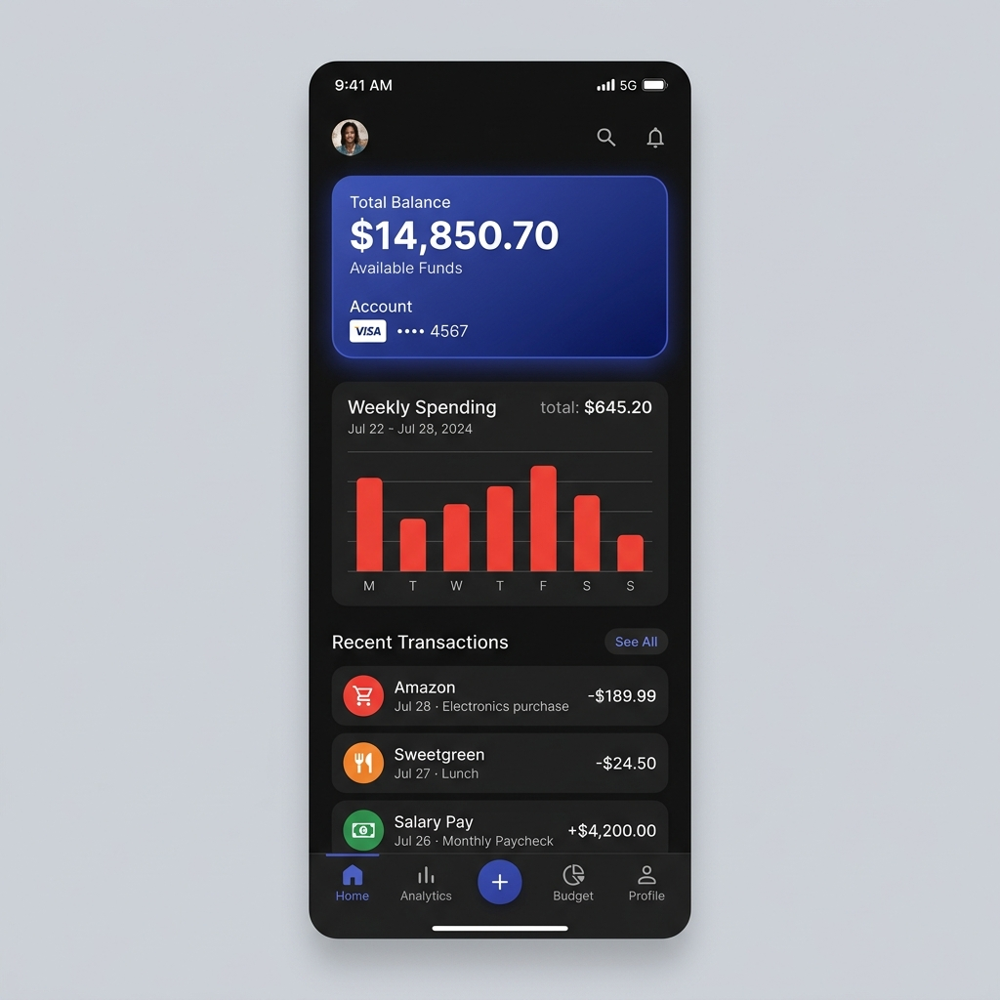

# 💰 Expense Tracker

A premium, feature-rich personal finance management application built with **Flutter**. Track your spending, manage your budget, and visualize your financial habits with elegant charts and a modern UI.



## 🌟 Key Features

- **Intuitive Dashboard**: At-a-glance view of your total balance, monthly income, and total expenses.
- **Dynamic Weekly Chart**: Visualize your spending patterns over the last 7 days with interactive bar charts.
- **Budget Tracking**: Set monthly budgets and track your progress with a real-time progress bar.
- **Smart Categorization**: Organize transactions into categories like Food, Transport, Shopping, Health, and more.
- **Search & Filter**: Quickly find any transaction using the built-in search functionality.
- **Persistence**: Powered by **Hive**, a lightweight and blazing-fast key-value database for Flutter.
- **Material 3 Design**: Experience a modern, sleek interface with smooth animations and responsive layouts.

## 🚀 Getting Started

### Prerequisites

- [Flutter SDK](https://docs.flutter.dev/get-started/install) (v3.10.0 or higher)
- [Dart SDK](https://dart.dev/get-dart)
- An IDE like VS Code or Android Studio

### Installation

1. **Clone the repository:**
   ```bash
   git clone https://github.com/malikmajid161/Expense_tracker.git
   ```

2. **Navigate to the project directory:**
   ```bash
   cd expense_tracker
   ```

3. **Install dependencies:**
   ```bash
   flutter pub get
   ```

4. **Generate Hive Adapters:**
   ```bash
   flutter pub run build_runner build --delete-conflicting-outputs
   ```

5. **Run the app:**
   ```bash
   flutter run
   ```

## 📊 Technical Stack

- **Framework**: [Flutter](https://flutter.dev/)
- **State Management**: [Provider](https://pub.dev/packages/provider)
- **Database**: [Hive](https://pub.dev/packages/hive)
- **Charts**: [FL Chart](https://pub.dev/packages/fl_chart)
- **Utilities**: [Intl](https://pub.dev/packages/intl), [Uuid](https://pub.dev/packages/uuid)

## 🛠️ Project Structure

```text
lib/
├── models/         # Data models and Hive adapters
├── providers/      # State management logic
├── screens/        # Main application screens (Home, Stats, Settings)
├── services/       # Database and API services
├── widgets/        # Reusable UI components (Charts, Cards, etc.)
└── main.dart       # App entry point
```

## 🤝 Contributing

Contributions are welcome! If you'd like to improve the app, please feel free to:
1. Fork the Project
2. Create your Feature Branch (`git checkout -b feature/AmazingFeature`)
3. Commit your Changes (`git commit -m 'Add some AmazingFeature'`)
4. Push to the Branch (`git push origin feature/AmazingFeature`)
5. Open a Pull Request

## 📄 License

This project is licensed under the MIT License - see the LICENSE file for details.

---
Made with ❤️ by [MAJID ALI && Khuzaima Ishtiaq](https://github.com/malikmajid161)
